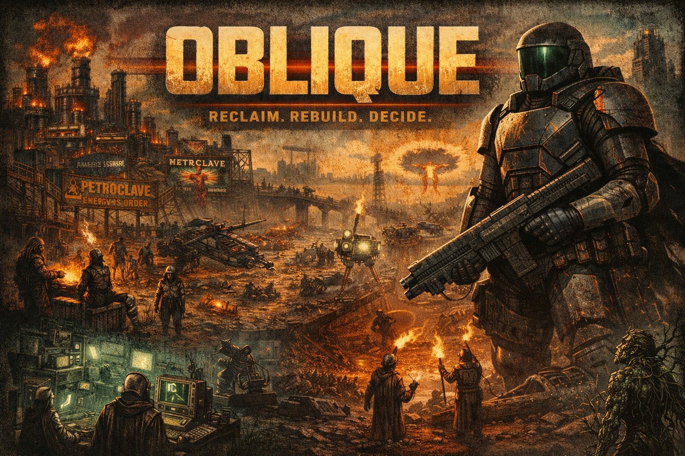

# Oblique Engine

*A retro-style isometric RPG engine built in pure C, powering the post-apocalyptic world of Oblique.*

This is a masochistically low-level engine being built from scratch using C and SDL2. The goal is to explore what it takes to make a working isometric game engine in the style of late-90s CRPGs, and to build a solid understanding of systems-level programming, rendering, game loops, and engine architecture.

> "Why not use Unity?"
> Because I want to suffer **on purpose**.

---

## 🌍 About Oblique

**Oblique** is a post-apocalyptic isometric RPG set in an alternate-history 1980s America where nuclear warfare, not nuclear power, shaped the world. The game follows a Reclaimer—an operative of the American Reclamation Authority (ARA)—as they navigate a world controlled by warring factions: the oil-controlling Petroclave, scattered Settler communities, the fanatical Reverent Forge, and the knowledge-hoarding Circuit Keepers.

The player wears **Obelisk armor**—lightweight, unyielding, and righteous—as they decide whether to restore the old world, burn it down, or build something entirely new.



*For full world backstory and faction details, see the [Game Design Document](#game-world--factions) below.*

---

## Features (Planned or Working)

* [x] 2D tile-based map system
* [x] Isometric projection rendering
* [x] Player movement with camera following
* [x] Grid overlay system with click-to-select
* [x] Tile highlighting and selection
* [x] Screen-to-tile coordinate conversion (with camera offset)
* [x] Basic UI system
* [x] Entity system with behavior functions
* [x] NPC AI system (idle, wander, chase behaviors)
* [x] Scene management system
* [ ] Inventory screen with three dumb items
* [ ] Collision detection system
* [ ] Combat system
* [ ] Quests and triggers
* [ ] Save/load system
* [ ] Audio support
* [ ] A reason to keep going

---

## Tech Stack

* **Language:** C (C99, because ANSI was just *too* cursed)
* **Libraries:** SDL2 for graphics and input, SDL2_image for asset loading
* **Assets:** Placeholder pixel art (probably from OpenGameArt or MSPaint)
* **Build system:** Makefile (pain edition)

---

## Project Structure

The engine is organized into **modular subsystems**, each with clear responsibilities and interfaces:

```
oblique/
├── engine/                   # Engine subsystems
│   ├── core/                 # Core engine systems
│   │   ├── constants.c/h     # Game constants and configuration
│   │   ├── engine.c/h        # Engine initialization
│   │   ├── game.c/h          # Game loop and main logic
│   │   ├── input.c/h         # Input handling
│   │   ├── map.c/h           # Map loading and tile system
│   │   ├── scene.c/h         # Scene management (explore, combat)
│   │   └── combat.c/h        # Combat system (planned)
│   ├── entity/               # Entity system
│   │   ├── entity.c/h        # Entity lifecycle and management
│   │   └── player.c/h       # Player-specific logic and input
│   ├── render/               # Rendering system
│   │   ├── camera.c/h        # Camera and viewport management
│   │   └── render.c/h        # Rendering pipeline
│   ├── navigation/           # Navigation and grid system
│   │   ├── grid.c/h          # Grid overlay, tile selection, coordinate conversion
│   ├── ai/                   # AI system
│   │   ├── ai.c/h            # AI state machine and brain logic
│   │   └── behavior.c/h      # Behavior functions (wander, idle, chase)
│   ├── collision/            # Collision detection
│   │   ├── collision.c/h     # Collision queries and resolution
│   ├── ui/                   # UI system
│   │   ├── ui.c/h            # User interface rendering
│   └── helpers/              # Utility functions
│       └── sdl_helpers.c/h   # SDL initialization and cleanup
├── data/                     # Game assets and data
│   ├── fonts/                # Font files
│   ├── maps/                 # Map data files
│   ├── sprites/              # Sprite assets
│   └── tiles/                # Tile assets
├── src/                      # Application entry point
│   └── main.c                # Main function and game loop
├── tools/                    # Development tools
│   └── map_editor/           # Map editor utility
│       ├── map_editor.c/h
└── Makefile                  # Build configuration
```

---

## Architecture & Data Flow

The engine follows a **system-based architecture** where subsystems communicate through well-defined interfaces. Here's the main game loop and data flow:

### Main Game Loop

```
1. Input System      → Capture keyboard/mouse events
2. Player Input      → Handle mouse clicks for tile selection
3. Scene Update      → Update all systems:
   ├── Camera        → Follow player position
   ├── Grid          → Calculate valid movement tiles
   ├── Entities      → Update all entities (player + NPCs)
   │   ├── AI Brain  → Update NPC AI states
   │   └── Behavior  → Execute behavior functions
   └── Collision     → Resolve movement conflicts
4. Render System     → Draw frame:
   ├── Map           → Draw tile grid
   ├── Grid          → Draw grid outlines
   ├── Selected Tile → Draw selected tile highlight
   └── Entities      → Draw all entities with depth sorting
5. Present           → Show frame on screen
```

### Subsystem Organization

Each subsystem is **encapsulated** with its own interface, making the engine modular and maintainable:

- **Core System** (`core/`) - Manages the game loop, input, scenes, and map loading
- **Entity System** (`entity/`) - Handles all game objects (player, NPCs, props) with behavior functions
- **Render System** (`render/`) - Manages isometric projection, camera, and rendering pipeline
- **Navigation System** (`navigation/`) - Grid overlay, tile selection, screen-to-tile coordinate conversion
- **AI System** (`ai/`) - Provides AI state machine and behavior functions that can be assigned to entities
- **Collision System** (`collision/`) - Handles collision detection and resolution
- **UI System** (`ui/`) - Renders user interface elements

This structure allows each system to be **developed and replaced independently** without rewriting the entire engine.

---

## How to Run

1. Install SDL2 (`libsdl2-dev` on Linux, `brew install sdl2` on macOS, or cry on Windows)
2. Install SDL2_image (`libsdl2-image-dev` on Linux, `brew install sdl2_image` on macOS)
3. Clone the repo
4. Run `make`
5. Pray
6. Execute `./oblique` and behold the janky glory

---

## Controls

* **Mouse Click** - Click on a grid tile to select it and move the player
* **Arrow Keys** - Move the player (legacy, will be replaced with full grid-based movement)

---

## Goals

* Master C through practical, painful use
* Understand game architecture from scratch
* Build a modular, maintainable engine architecture
* Create clear subsystem boundaries with well-defined interfaces
* Build something that *feels* powerful, even if it's held together with duct tape
* Create a playable, working isometric RPG prototype for Oblique

---

## Design Philosophy

The engine is structured around **modular ownership** - each subsystem has clear responsibilities and interfaces. Entities use behavior function pointers (`BehaviorFunc`) that allow AI behaviors to be assigned dynamically. This design makes the system:

- **Replaceable**: Systems can be swapped out without rewriting everything
- **Extensible**: New behaviors can be added by implementing the `BehaviorFunc` interface
- **Testable**: Each subsystem can be tested independently
- **Future-proof**: Ready for scripting system integration later

Right now behaviors are hardcoded functions (`wander_behavior`, `idle_behavior`, etc.), but the interface is designed to support scripted behaviors in the future without major refactoring.

---

## Game World & Factions

### 🌍 The World of Oblique

**Genre:** Isometric post-apocalyptic RPG  
**Aesthetic:** 1980s retro-futurism, oil-stained dystopia, militarized techno-Americana  
**Theme:** Rebuild the future. Or burn it again.

### 💣 Alt-History Backstory

History didn't veer off because of nuclear power—it veered because of nuclear warfare.

In the world of Oblique, nuclear energy was never embraced as a civilian power source. It remained what it was designed to be: a weapon. America, victorious and ravenous after World War II, fell into the hands of General Douglas MacArthur, who rose to presidency following a decisive nuclear victory in the Korean War.

His doctrine of preemptive strength—massive force at any cost—set the tone for the rest of the century. America crushed North Vietnam in record time. Anti-war sentiment never had a chance to form. The Cold War didn't freeze—it ignited. By the 1980s, tactical nukes were being used around the world like drone strikes. The air thickened. The oceans boiled. Oil fields burned like signal fires.

In 1985, the world finally collapsed under its own military-industrial weight. A full-scale nuclear exchange between the U.S., USSR, and China turned Earth into a choking furnace of smoke, ash, and decay.

And from the ruins… came silence. Then, survival. Then… control.

### 🛡️ The Player's Faction: The American Reclamation Authority (ARA)

**"Restore. Reclaim. Rebirth."**

You are a Reclaimer—an operative of the ARA, an underground remnant of the pre-war American government, bred and trained in isolation for one purpose: Rebuild America.

The ARA is not a people's movement. It is a program. A mission. A cult of patriotic doctrine, forged in the bunkers beneath D.C. and scattered across the country. Its agents wear reclamation armor like sacred vestments and carry energy weapons that hum with ancestral fury.

They believe the world can be restored. But only their version of it.

**Key Traits:**
* Brainwashed military idealism
* Access to rare and advanced energy weapons
* Reclamation armor (Obelisks)
* Radio broadcast propaganda drones
* Small in number, massive in firepower

**Player's Conflict:**
* The world doesn't want to be saved by you.
* You've been trained to rebuild a country that doesn't exist anymore.
* You can liberate… or conquer.

### ⚙️ The Major Factions

#### 🛢️ The Petroclave

**"Energy is Order."**

The Oil Barons never fell. When the world burned, they just turned off the lights and waited. Now, decades later, they've re-emerged, controlling the only functional power grids, fuel refineries, and pre-war infrastructure left in the South.

They've evolved into a corporate-feudal cult, where each "Baron" runs a city-state powered by black gold. The Petroclave decides who gets power and who gets left in the dark. Literally.

**Key Traits:**
* Massive influence over energy distribution
* Private armies equipped with diesel-powered exosuits, flamethrowers, and combustion-based tech
* Operate out of fortified refineries and rig cities
* Treat settlers like debt-bound laborers
* Worship industrial power as a divine right

#### 🪓 The Settlers

**"We dig. We bleed. We survive."**

Scattered survivors who carved lives out of irradiated ruins and chemical wastelands. These are the families, scavengers, drifters, farmers, and raiders who never had a bunker or a flag—just guns, grit, and duct tape.

They've been under Petroclave rule for decades, trading labor for power, food, or water. But now that the ARA has emerged, some see a new path forward.

Others? They see another tyrant in fancy armor.

**Key Traits:**
* Varied tech (from bolt-action rifles to homemade drones)
* Culture is regionally divided: bayou cultists, desert warbands, ruined city gangs, etc.
* Can be rallied—but easily divided
* Morally complex, desperate, human

#### 🔥 The Reverent Forge

**"Heat is purity. Fire is rebirth."**

An offshoot cult that broke from the Petroclave, the Forge believes in literal purification through combustion. They operate furnace-halls, burn offerings, and see technology as holy when powered by fire.

They are feared even by the Barons. They wear melted metal like armor. They eat coal.

**Key Traits:**
* Fire-based melee weapons and flamethrowers
* Fanatical devotion to "The Flame Protocols"
* Ritual sacrifices of "unclean tech"
* Wear boilerplate armor and respirators
* Often nomadic, but hold massive bonfire ceremonies in ruined stadiums and arenas

#### 📡 The Circuit Keepers

**"All knowledge must be preserved… and restricted."**

Based out of a crumbling data center once run by the military-industrial complex, the Circuit Keepers are a cult of archivists, engineers, and failed AI worshippers.

They hoard information and tech, believing only they are qualified to steward the world's knowledge. Occasionally, they sell old-world blueprints to desperate factions—at a price.

**Key Traits:**
* Fragile but extremely advanced in technology
* Drone networks, radio-wave weaponry, surveillance tech
* Mostly passive, until provoked
* Some seek alliance with the ARA. Others see it as a threat to their monopoly.

### 🗿 Reclaimer Armor – "Obelisks"

**"Lightweight. Unyielding. Righteous."**

Reclaimers wear Obelisk armor—carbon nanotube lattice plating powered by HY-DRA cores (Hydrogen-Dynamic Reclamation Arrays). The armor is not just protection; it's a symbol of the ARA's mission and a tool of both liberation and oppression.

**Design Principles:**
* Ultra-lightweight carbon nanotube composite that hardens on impact
* Hydrogen fuel cell power source with weeks of operation
* Neuro-linked HUD with tactical overlay, night vision, and voice commands
* Bulletproof at medium to long range, highly resistant to energy weapons
* Agile and responsive—operates like a second skin with servo assistance

**Visual Style:**
* Stormtrooper × Master Chief × Robocop × 80s Black-Ops Mascot
* Full-face visor, semi-reflective, no human detail visible
* Clean, angular, military-industrial lines
* Color scheme: matte black, gunmetal, ceramic white
* Rank insignias burned into the plating

People don't say "He's wearing armor."  
They say "He's wearing an Obelisk."

That's terrifying. That's powerful. That's Oblique.

---

## What This Isn't

* A modern game engine
* Easy to use
* Documented well (yet)
* Mentally healthy

---

## Status

Currently in **pre-alpha tech demo** phase. You can move around, click on grid tiles to select and move, watch NPCs wander with AI behaviors, and contemplate your life choices. The engine architecture is becoming more cohesive with each refactor, moving from "prototyping chaos" toward "modular system of systems."

---

## License

MIT. Do whatever you want. But if you blame me for your suffering, that's on you.

---

## Author

Built by someone who decided that pain = progress.
